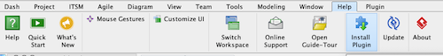
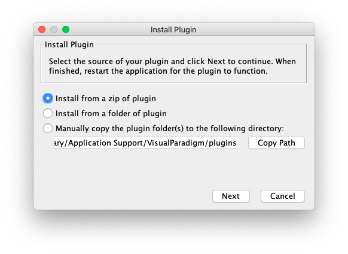
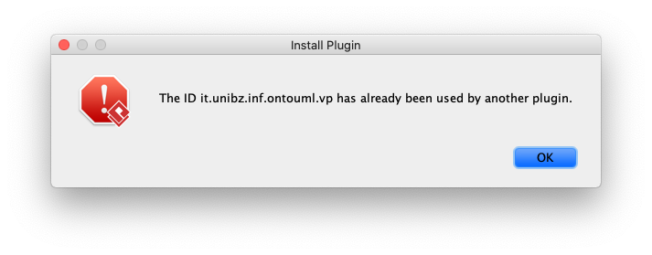
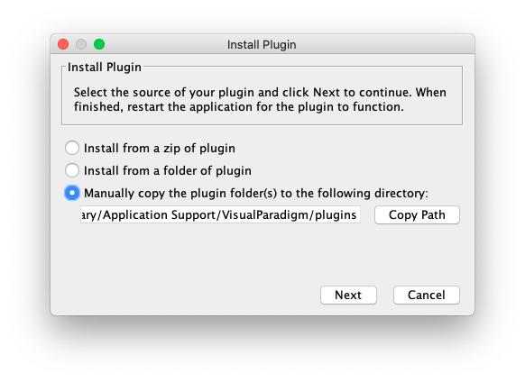

# OntoUML Plugin for Visual Paradigm

This project contains a [Visual Paradigm](https://www.visual-paradigm.com/) plugin that enables the development of OntoUML models.

This project is defined under the umbrella of the [OntoUML Server](https://github.com/OntoUML/ontouml-server) project and is currently a proof of concept.

If you are interested to know more, feel free to open an issue to provide feedback on the project or reach our team members for more specific cases:

* [Claudenir M. Fonseca](https://github.com/claudenirmf)
* [Tiago Prince Sales](https://github.com/tgoprince)
* [Lucas Bassetti](https://github.com/LucasBassetti)
* [Victor Viola](https://github.com/victorviola)

## Contents

* [User Instructions](#user-instructions)
* [Developer Instructions](#developer-instructions)
* [Report Errors](#report-errors)
* [FAQ](#faq)

___

## User Instructions

To **install** or **update** the **OntoUML Plugin for Visual Paradigm**, please go to our [releases page](https://github.com/OntoUML/ontouml-vp-plugin/releases) and download the ZIP file `ontouml-vp-plugin` in the latest release. Then go to `Help > Install Plugin` in the top of your window and, after clicking `Install from a zip of plugin` and `Next`, select the download release.





For more details, check out this [guide](https://knowhow.visual-paradigm.com/openapi/how-to-deploy-plugins-to-vp-application/).

Back to [top](#ontouml-plugin-for-visual-paradigm).

___

## Developer Instructions

### Requirements

* [Visual Paradigm](https://www.visual-paradigm.com/)
* Java 8 or later
* Maven (optional, a Maven Wrapper is embedded in the project) 

### Build instructions

#### Setting up

1. Clone the project

    `git clone https://github.com/OntoUML/ontouml-vp-plugin.git`

2. Open `pom.xml` and set the value of the variables listed below:

    2.1. Set the path to the folder in which the Visual Paradigm application is located:

    ```xml
    <visualparadigm.app.dir>
       /Applications/Visual Paradigm.app/Contents/Resources/app
    </visualparadigm.app.dir>
    ```

    This path is typically:

    * On Windows: `C:\Program Files\Visual Paradigm CE 16.1`
    * On macOS: `/Applications/Visual Paradigm.app/Contents/Resources/app/`

   2.2. Set the path to Visual Paradigm's plugin folder

   ```xml
    <visualparadigm.plugin.dir>
        /Users/<YOUR_USERNAME>/Library/Application Support/VisualParadigm/plugins
    </visualparadigm.plugin.dir>
    ```

    This path is typically:

    * On Linux: `~/.config/VisualParadigm/plugins/`
    * On Windows: `C:\Users\<YOUR_USER_NAME>\AppData\Roaming\VisualParadigm\plugins\`
    * On macOS: `/Users/<YOUR_USERNAME>/Library/Application Support/VisualParadigm/plugins/`

#### Maven Commands

The commands listed below invoke Maven through the Maven Wrapper. 
On Windows, replace `./mvnw` for `./mvnw.cmd`

In any OS, to invoke your local Maven installation instead of the wrapper, replace `./mvnw` with `mvn`.

* To **compile** the plugin, run:

     ```shell script
    $ ./mvnw compile
    ```

    The compiled files will be created in the `target` folder.

* To **compile** and **package** the plugin, run 

    ```shell script
    $ ./mvnw package
    ```
  
  This command will create, within the `target` folder, a `*.zip` file that can be distributed to the end users of the plugin.

* To **compile**, **package**, and **install** the plugin, run

    ```shell script
    $ ./mvnw install
    ```
  
    In addition to the previous results, this command will copy the compiled files to Visual Paradigm's `plugins` folder.

* To **run** Visual Paradigm while being able to see the output in the command line, run:

    ```shell script
    $ ./mvnw exec:exec
    ```
  
    Note that before running this command, you should install the plugin. That can be achieved by running:

    ```shell script
    $ ./mvnw install exec:exec
    ```
  
* To **clean** the built files, run:

    ```shell script
    $ ./mvnw clean
    ```
  
    This does not remove the installed files, just the `target` folder and its contents.

Back to [top](#ontouml-plugin-for-visual-paradigm).

___

## Report Errors

In case you are reading this, thank you for interesting on contributing to our efforts by submitting your questions/suggestions or reporting errors in our tool.

If you have a GitHub account, head over to our [issues section](https://github.com/OntoUML/ontouml-vp-plugin/issues) and submit bugs, suggestions, or questions.

If you don't have a GitHub account but still would like to contribute by reporting an error in our plugin, please fill in this [form](https://forms.gle/btx7CDSy9kn5yb3WA) sharing as many details as you wish. We will be creating a issue to discuss and solve any problems and improve our tool.

Before submitting issues, however, search for [previous issues](https://github.com/OntoUML/ontouml-vp-plugin/issues) or questions in our [FAQ](#faq) as there may already be a solution to your problem.

Back to [top](#ontouml-plugin-for-visual-paradigm).

___

## FAQ

### Why do I get the error message "The ID [...] is already in use"?



Each Visual Paradigm plugin must (i) have an ID, and (ii) be installed in a specific folder. If you are updating to a new version of the plugin, it may occur that the name of the folder has changed. In this case, Visual Paradigm will think that you are trying to install a new plugin with an ID already in use instead of updating it.



To solve this issue, go to the `plugins` folder listed in the "Install Plugin" window (see above) and delete your old plugin folder before installing the new version. You may be required to re-open the application for that to take effect.

Back to [top](#ontouml-plugin-for-visual-paradigm).
