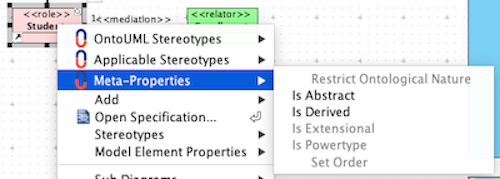
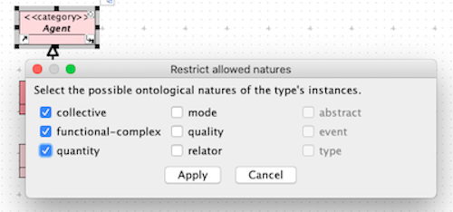
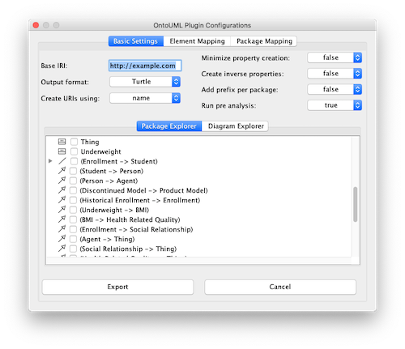
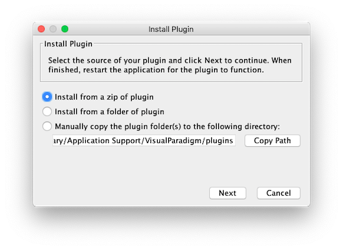
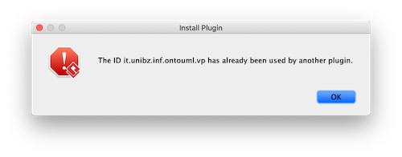
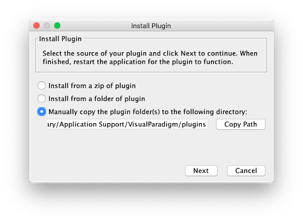

# OntoUML Plugin for Visual Paradigm

This project contains a [Visual Paradigm](https://www.visual-paradigm.com/) plugin that enables the development of OntoUML models.

This project is defined under the umbrella of the [OntoUML Server](https://github.com/OntoUML/ontouml-server) project and is currently a proof of concept.

If you are interested to know more, feel free to open an issue to provide feedback on the project or reach our team members for more specific cases:

* [Claudenir M. Fonseca](https://github.com/claudenirmf)
* [Tiago Prince Sales](https://github.com/tgoprince)
* [Lucas Bassetti](https://github.com/LucasBassetti)
* [Victor Viola](https://github.com/victorviola)

## Contents

* [Overview](#overview)
* [User Instructions](#user-instructions)
* [Developer Instructions](#developer-instructions)
* [Report Errors](#report-errors)
* [FAQ](#faq)

___

## Overview

The **OntoUML Plugin for Visual Paradigm** adds to any version of Visual Paradigm features designed for OntoUML modelers. These features range from enabling OntoUML stereotypes in class diagrams to model verification and transformation.

WARNING: some more advanced features are based on web services that process your model remotely. The software processing these models is also [openly available](https://github.com/OntoUML/ontouml-server) and if you prefer to have your models processed in your own server, you are able to set it up and change the server URL in the plugin's settings.

### Features

#### OntoUML Enhanced Modeling

Stereotypes and meta-properties that are essential to OntoUML modeling are easily available to classes, associations and attributes with a simple right-click.

Notice that beyond the full list of stereotypes, a dynamic list of stereotypes is also available. This dynamic list is usually preferred during modeling as it filters wrong stereotypes for your class or association based on, respectively, their super/sub classes and their associated classes. The full list, however, tends to provide a faster and more flexible option during model fixing and refactoring.






Try selecting multiple elements to fast update your models!

#### Smart Paint

Automatic diagram painting based on the possible instances of classes with highlighted ultimate sortals (i.e., «kind», «collective», «quantity», «relator», «mode», and «quality») for improved model readability.


#### Smart Modeling

Smart modeling allows the plugin to set default values to OntoUML model elements based on their stereotypes that are different from the defaults of UML speeding up modeling.

Since the Smart Paint feature depends on the "restrictedTo" meta-property, it is directly affected by Smart Modeling (responsible for assigning this meta-property).

#### Model Verification and Diagram Verification

Automatic verification of OntoUML syntactical rules which are reported to the user to manage. At the moment the list of constraints is being re-developed and users may find that new checks were introduced during the period they work on their products.

The Diagram Verification feature performs the verification of the whole model but only displays issues about elements present in the currently open diagram, facilitating the user's task of fixing models.


#### Model Transformation to OWL with gUFO

Model transformation into OWL with support of the [Lightweight Implementation of the Unified Foundational Ontology (UFO) - gUFO](https://nemo-ufes.github.io/gufo/).

Users must select the elements that shall be exported to gUFO either selecting from the model or from the desired diagrams. A number of options may also be set by the user for the transformation.

**WARNING**: the transformation feature require the presence of no verification errors among the exported entities. In addition, partial transformations of the model should be executed with care as they may introduce violations of some syntactical constraint.



### Automatic Diagram Generation

Diagram generation allows users to include into their projects automatically generated diagrams that advantage from OntoUML features to create meaningful views of their ontologies.


#### Continuous Updates

The cloud-based features offered in the plugin are periodically updated. Updates in these features usually do not require updates in the Visual Paradigm plugin.

And last, but not least, this project is supported by the [OntoUML.org](https://ontouml.org/) community and its set of features will only grow, incorporating new and updated OntoUML technologies.


In order to update to a new version of the plugin, please download the latest [release](https://github.com/OntoUML/ontouml-vp-plugin/releases) as a ZIP file and select it through the "Update Plugin" button in the plugin (available from version 0.3.0).

Back to [top](#ontouml-plugin-for-visual-paradigm).

___

## User Instructions

To **install** or **update** the **OntoUML Plugin for Visual Paradigm**, please go to our [releases page](https://github.com/OntoUML/ontouml-vp-plugin/releases) and download the ZIP file `ontouml-vp-plugin` in the latest release. Then go to `Help > Install Plugin` in the top of your window and, after clicking `Install from a zip of plugin` and `Next`, select the download release.




For more details, check out this [guide](https://knowhow.visual-paradigm.com/openapi/how-to-deploy-plugins-to-vp-application/).

Back to [top](#ontouml-plugin-for-visual-paradigm).

___

## Developer Instructions

### Requirements

* [Visual Paradigm](https://www.visual-paradigm.com/)
* Java 8 or later
* Maven (optional, a Maven Wrapper is embedded in the project) 

### Build instructions

#### Setting up

1. Clone the project

    `git clone https://github.com/OntoUML/ontouml-vp-plugin.git`

2. Open `pom.xml` and set the value of the variables listed below:

    2.1. Set the path to the folder in which the Visual Paradigm application is located:

    ```xml
    <visualparadigm.app.dir>
       /Applications/Visual Paradigm.app/Contents/Resources/app
    </visualparadigm.app.dir>
    ```

    This path is typically:

    * On Windows: `C:\Program Files\Visual Paradigm CE 16.1`
    * On macOS: `/Applications/Visual Paradigm.app/Contents/Resources/app/`

   2.2. Set the path to Visual Paradigm's plugin folder

   ```xml
    <visualparadigm.plugin.dir>
        /Users/<YOUR_USERNAME>/Library/Application Support/VisualParadigm/plugins
    </visualparadigm.plugin.dir>
    ```

    This path is typically:

    * On Linux: `~/.config/VisualParadigm/plugins/`
    * On Windows: `C:\Users\<YOUR_USER_NAME>\AppData\Roaming\VisualParadigm\plugins\`
    * On macOS: `/Users/<YOUR_USERNAME>/Library/Application Support/VisualParadigm/plugins/`

#### Maven Commands

The commands listed below invoke Maven through the Maven Wrapper. 
On Windows, replace `./mvnw` for `./mvnw.cmd`

In any OS, to invoke your local Maven installation instead of the wrapper, replace `./mvnw` with `mvn`.

* To **compile** the plugin, run:

     ```shell script
    $ ./mvnw compile
    ```

    The compiled files will be created in the `target` folder.

* To **compile** and **package** the plugin, run 

    ```shell script
    $ ./mvnw package
    ```
  
  This command will create, within the `target` folder, a `*.zip` file that can be distributed to the end users of the plugin.

* To **compile**, **package**, and **install** the plugin, run

    ```shell script
    $ ./mvnw install
    ```
  
    In addition to the previous results, this command will copy the compiled files to Visual Paradigm's `plugins` folder.

* To **run** Visual Paradigm while being able to see the output in the command line, run:

    ```shell script
    $ ./mvnw exec:exec
    ```
  
    Note that before running this command, you should install the plugin. That can be achieved by running:

    ```shell script
    $ ./mvnw install exec:exec
    ```
  
* To **clean** the built files, run:

    ```shell script
    $ ./mvnw clean
    ```
  
    This does not remove the installed files, just the `target` folder and its contents.

Back to [top](#ontouml-plugin-for-visual-paradigm).

___

## Report Errors

In case you are reading this, thank you for interesting on contributing to our efforts by submitting your questions/suggestions or reporting errors in our tool.

If you have a GitHub account, head over to our [issues section](https://github.com/OntoUML/ontouml-vp-plugin/issues) and submit bugs, suggestions, or questions.

If you don't have a GitHub account but still would like to contribute by reporting an error in our plugin, please fill in this [form](https://forms.gle/btx7CDSy9kn5yb3WA) sharing as many details as you wish. We will be creating a issue to discuss and solve any problems and improve our tool.

Before submitting issues, however, search for [previous issues](https://github.com/OntoUML/ontouml-vp-plugin/issues) or questions in our [FAQ](#faq) as there may already be a solution to your problem.

Also, the more detailed your issue the better. Therefore, we encourage you to share with us details on what happened, screenshot, project files (either `.vpp` files or [exported XML projects](https://www.visual-paradigm.com/support/documents/vpuserguide/124/218/6848_exportingxml.html)), and Visual Paradigm logs (see [how to retrieve Visual Paradigm's log](https://knowhow.visual-paradigm.com/technical-support/vp-log/)). Remember that the issues you post (differently from the [form](https://forms.gle/btx7CDSy9kn5yb3WA)) are public.

Back to [top](#ontouml-plugin-for-visual-paradigm).

___

## FAQ

* [Why do I get the error message "The ID [...] is already in use"?](#why-do-i-get-the-error-message-"the-id-[...]-is-already-in-use")

* [Why Protégé gives me an error message when I try to open my ontology exported to gUFO?](#why-protégé-gives-me-an-error-message-when-i-try-to-open-my-ontology-exported-to-gufo)

* [I had an error while updating the plugin through the "Update Plugin" button and now it does not work](#I-had-an-error-while-updating-the-plugin-through-the-"Update-Plugin"-button-and-now-it-does-not-work)

### Why do I get the error message "The ID [...] is already in use"?



Each Visual Paradigm plugin must (i) have an ID, and (ii) be installed in a specific folder. If you are updating to a new version of the plugin, it may occur that the name of the folder has changed. In this case, Visual Paradigm will think that you are trying to install a new plugin with an ID already in use instead of updating it.



To solve this issue, go to the `plugins` folder listed in the "Install Plugin" window (see above) and delete your old plugin folder before installing the new version. You may be required to re-open the application for that to take effect.

### Why Protégé gives me an error message when I try to open my ontology exported to gUFO?

Some users reported issues when trying to open their ontologies on [Protégé](https://protege.stanford.edu/) after using the ["Export to gUFO"](#Model-Transformation-to-OWL-with-gUFO) feature. In order to avoid this problem, we recommend you to use stable releases of Protégé (the desktop version) and avoid beta releases. You can find the latest release on their [official website]((https://protege.stanford.edu/)) and their complete list of releases in this [link](https://protegewiki.stanford.edu/wiki/Protege_Desktop_Old_Versions).

Also, make sure that your machine is connected to the internet so Protégé can load the [gUFO](https://nemo-ufes.github.io/gufo/) ontology which is used but not included in the exported file.

If you still have problems opening your ontology, please [report it](#Report-Errors) so we can improve our solutions.

### I had an error while updating the plugin through the "Update Plugin" button and now it does not work

In that case, the error may have corrupted the previous installation. Please access the plugins folder of Visual Paradigm (instructions [here](#why-do-i-get-the-error-message-"the-id-[...]-is-already-in-use")) and manually remove old plugins' folders. After this, extract the new version you tried to update to into this (now empty) folder. If you have other Visual Paradigm plugins in these folder, there is no need to delete does, only the OntoUML one.

Back to [top](#ontouml-plugin-for-visual-paradigm).
